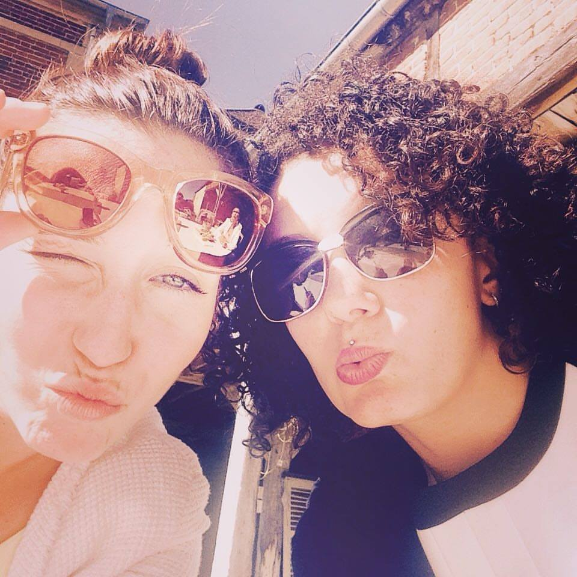

<!DOCTYPE html>
<html lang='en'>

<head>
	<meta charset="utf-8"> 
	<link type="text/css" rel="stylesheet" href="annafile/bootstrap/bootstrap.css">
	<link rel="stylesheet" type="text/css" href="css.css">
	<meta name="viewport" content="width=device-width, initial-scale=1.0">
	<link rel="stylesheet" href="https://maxcdn.bootstrapcdn.com/bootstrap/3.3.7/css/bootstrap.min.css" integrity="sha384-BVYiiSIFeK1dGmJRAkycuHAHRg32OmUcww7on3RYdg4Va+PmSTsz/K68vbdEjh4u" crossorigin="anonymous">
	<title>NaturAddict</title>
</head>

<body>
 <nav class="navbar navbar-custom navbar-fixed-top" role="navigation">
        

            
            <!-- Collect the nav links, forms, and other content for toggling -->
            

                <ul class="nav navbar-nav">
                    <!-- Hidden li included to remove active class from about link when scrolled up past about section -->
                    <li class="hidden">
                        
                    </li>
                    <li>
                        <a class="page-scroll" href="#About_Us_index">About Us</a>
                    </li>
                    <li>
                        <a class="page-scroll" href="#shop">Shop</a>
                    </li>
                    <li>
                        <a class="page-scroll" href="#Contact_form">Contact Us</a>
                    </li>
                </ul>
            

        

    </nav>

   

    

        <h1>NaturAddict</h1>
    
        
The new brand that offers to your skin the best care while respecting our environment !
 
    

    

    
    <form role='form'>
      <label for="email">Find out more</label>
      <input type="text" name="Email" >
      <button class='btn-lg btn-success'>Send</button>
	</form>
    	

    
  

     

    

    

    <h1>For Your Body</h1>
    
    

    

     

     

     <h1>For your Hair</h1>
     
     

     

    

    

    <h1>For your Face</h1>
    
    

    

    

 

      <button class='btn-small btn-twitter'>Twitter</button>
      <button class='btn-small btn-facebook' class='btn btn-small' href="https://www.facebook.com/NaturAddict/">Facebook</button>
      <button class='btn-small btn-pinterest' class='btn btn-small'>Instagram</button>
    

    

<footer>Copyright 2017</footer>

</body>
</html>
